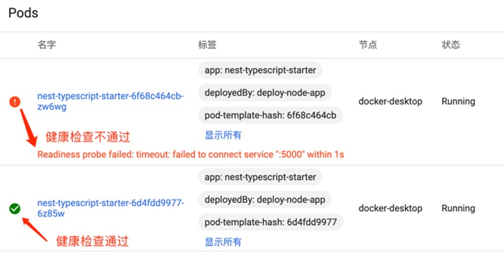

# nestjs-hero-grpc-sample-with-health-check

[](https://travis-ci.com/Jeff-Tian/nestjs-hero-grpc-sample-with-health-check)

> Add standard grpc health check to the nest js hero grpc sample application.

## Why

nest js is lacking of a native way to support the standard gRPC health check of kubernetes cluster, so I created an
extension
for it: [grpc-health](https://github.com/Jeff-Tian/grpc-health). This repository demonstrates how to use [grpc-health](https://github.com/Jeff-Tian/grpc-health)

## Run locally

```bash
git clone https://github.com/Jeff-Tian/nestjs-hero-grpc-sample-with-health-check
cd nestjs-hero-grpc-sample-with-health-check
npm i
npm start
```

## Run test

```bash
npm test
```

## Deploy to Kubernetes

```bash
kubectl apply -k k8s
```

Or

```shell script
npm run k8s
```

## Usage example

By applying the deployment yaml file to your kubernetes cluster with the wrong port number and correct port number
you'll see from the dashboard that the health check of the first deployment is failing, and the 2nd one is working!



## Support me

If you find this repo useful, you can [buy me a coffee](https://jeff-tian.jiwai.win/support-me):

[](https://jeff-tian.jiwai.win/support-me)
